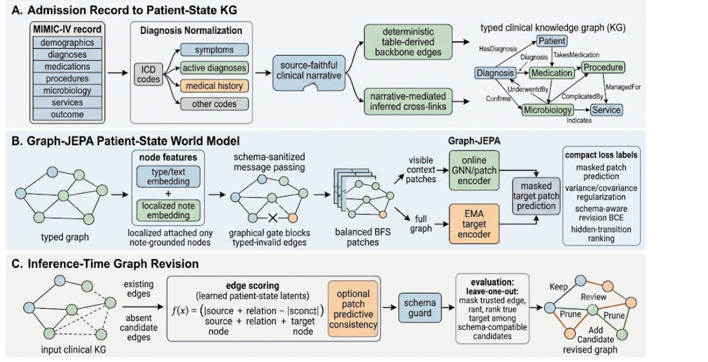

# Clinical Graph-JEPA

### Predictive patient-state knowledge graphs for cognitive decision support

[](https://openreview.net/forum?id=HXsMPubPqE)
[](https://www.python.org/)
[](https://pytorch.org/)

Clinical Graph-JEPA learns predictive patient-state representations from typed
clinical knowledge graphs. This repository provides a self-contained,
documented implementation suite for the paper, including note-free and
note-augmented Graph-JEPA models, released checkpoints, evaluation code, and a
400-admission graph dataset.

**Paper:** [OpenReview](https://openreview.net/forum?id=HXsMPubPqE) ·
[repository PDF](paper/clinical_jepa.pdf) ·
[paper-to-code map](docs/PAPER_CODE_MAP.md)

> [!IMPORTANT]
> This is a research system for improving structured patient representations.
> It does not make autonomous clinical decisions and is not intended for direct
> clinical use.

## Abstract

Clinical narratives contain relationships that are absent from structured
tables, but extraction errors, ontology mismatch, missing edges, and temporal
ambiguity can make automatically constructed knowledge graphs unreliable.
Clinical Graph-JEPA treats an extracted graph as a draft patient-state
representation rather than a finished artifact. It combines a deterministic
clinical backbone with inferred relations, then learns to recover masked or
missing graph structure from observed context using joint-embedding predictive
learning.

The paper studies two deployment settings: **Option A**, a note-free model for
admissions without available notes, and **Option B**, a note-augmented model
that places a Clinical-ModernBERT embedding only on the entities grounded by
the note. The reported entity-localized design improves inferred-edge recovery
from **0.274 to 0.419 MRR** over the note-free option while keeping the learned
world-model encoder frozen during relation readout.

## Method at a glance



*Figure 1 from the paper. See the [full PDF](paper/clinical_jepa.pdf) for its
caption and surrounding discussion.*

The figure has three stages:

1. **Admission record to patient-state KG.** Structured MIMIC-IV tables provide
   high-confidence backbone edges. The clinical narrative provides cross-links
   such as a medication being managed for a diagnosis or a procedure confirming
   a diagnosis. Nodes and relations are normalized into a typed graph.
2. **Graph-JEPA world-model learning.** A GNN converts node features and typed
   edges into patient-state latents. The modular models partition the graph into
   balanced local patches; an online branch predicts masked target-patch latents
   produced by a slowly updated EMA target branch. The standalone `fawkes`
   implementation follows the same predictive principle at node level.
3. **Graph revision and recovery.** Learned latents score observed and candidate
   relations. Schema rules reject clinically invalid type combinations, while
   leave-one-out evaluation measures whether a hidden true target is recovered
   above type-compatible alternatives.

The important JEPA idea is that the model predicts a **latent representation**
of missing graph state, not raw node text. The target encoder is not optimized
directly by backpropagation; its weights track the online encoder by an
exponential moving average. This supplies a stable learning target without
requiring a manually labeled target for every masked region.

## Which package is the paper?

> [!WARNING]
> **`fawkes` is the paper implementation. `clinical_jepa` is not.**
> The repository is named `clinical-graph-jepa` and the manuscript is
> `paper/clinical_jepa.pdf`, so `clinical_jepa` looks like the package behind
> the paper. It is not. The released checkpoint and the reported numbers come
> from `fawkes`, which keeps its original author's name.

| Package | What it is | Released checkpoint |
| --- | --- | --- |
| **`fawkes`** | **The paper implementation.** Standalone entity-note model; reproduces the published metrics. | `models/fawkes-entity-note/` |
| **`clinical_jepa`** | **Not the paper.** The modular patch-based Graph-JEPA graph-revision pipeline, in a note-free and a localized-note variant. | `models/clinical-jepa-no-note/`, `models/clinical-jepa-localized-note/` |
| **`benchmarks`** | Cross-lineage comparison; the only package permitted to import both of the above. | — |

`docs/LINEAGE.md` is the authority on what every package, module, symbol, and
model directory used to be called, and on why the old `v5`/`v6`/`v16` numbers
were never one version sequence.

## Included implementations

| Model | Package | Entity representation | Note input | Checkpoint input |
| --- | --- | --- | --- | --- |
| **Clinical-JEPA, no note** | `clinical_jepa` | 768-d SapBERT | None | 768 |
| **Clinical-JEPA, localized note** | `clinical_jepa` | 768-d SapBERT | 768-d entity-localized Clinical-ModernBERT | 1536 |
| **Fawkes entity-note** (the paper) | `fawkes` | Learned type + hashed-entity + demographics | 768-d entity-localized Clinical-ModernBERT | 774-dimensional numeric branch projected to hidden space |

The two `clinical_jepa` variants and the standalone `fawkes` model come from two
related development lineages. `fawkes` is not an architectural successor of the
localized-note variant, and their checkpoints are not interchangeable. See the
[paper-to-code map](docs/PAPER_CODE_MAP.md) for the exact correspondence.

The two `clinical_jepa` variants are one class and one config flag
(`use_note_embeddings`), not two models: their checkpoints have identical
`state_dict` key sets and differ only in two tensor shapes.

### Architecture comparison

| Stage | Clinical-JEPA, no note | Clinical-JEPA, localized note | Fawkes entity-note |
| --- | --- | --- | --- |
| Raw node signal | `TYPE: normalized_name` | `TYPE: normalized_name` plus admission note embedding | Node type, hashed normalized name, demographics, optional note embedding |
| Initial representation | Frozen SapBERT CLS embedding, 768-d | SapBERT 768-d + localized note 768-d = 1536-d | Three 128-d terms are added: learned type, learned hash bucket, projected numeric/note branch |
| GNN | 2-layer relation-aware GINE | Same | 2-layer, 4-head `TransformerConv` |
| Graph unit predicted by JEPA | Balanced BFS patch | Balanced BFS patch | Masked node latent |
| Latent width | 160 | 160 | 128 |
| Target branch | EMA node encoder + EMA patch transformer | Same | EMA copy of the graph encoder |
| Downstream objective | Schema-aware revision BCE + hard candidate ranking | Same, with confidence/artifact metadata | Frozen-encoder DistMult with InfoNCE and 8 type-matched negatives |
| Intended role | Note-free baseline and deployment option | Modular note-localization experiment | Direct standalone paper experiment/checkpoint |

For a full tensor-by-tensor walkthrough, use the model guides:

- [Clinical-JEPA without notes](models/clinical-jepa-no-note/README.md)
- [Clinical-JEPA with localized notes](models/clinical-jepa-localized-note/README.md)
- [Fawkes entity-note, the paper model](models/fawkes-entity-note/README.md)

## Audited evaluation results

Every number below is reproduced from a committed result file in `baseline/`,
each of which records the exact invocation that produced it. **The four rows are
not comparable with each other** — they use different models, different data and
different query populations. Read the "Population" column before the metrics.

| Result file | Model | Population | MRR | Hits@1 | Hits@3 | Hits@10 | n |
| --- | --- | --- | ---: | ---: | ---: | ---: | ---: |
| `paper_loo_testsplit.json` | Fawkes entity-note | **The published number.** Seeded test split, 400 of 4,000 real admissions | **0.418653** | 0.247495 | 0.473741 | 0.863576 | 8,283 |
| `paper_loo.json` | Fawkes entity-note | Shipped evaluator over the whole 4,000-record file | 0.440249 | 0.263050 | 0.500650 | 0.900450 | 40,000 |
| `v5_loo.json` | Clinical-JEPA, no note | *Seeded synthetic graphs — not real data* | 0.605425 | 0.343020 | 0.846724 | 1.000000 | 1,755 |
| `v6_loo.json` | Clinical-JEPA, localized note | *Seeded synthetic graphs — not real data* | 0.621116 | 0.365812 | 0.848433 | 1.000000 | 1,755 |

MRR rewards placing the true target near the top of the candidate ranking.
Hits@K is the fraction of queries whose true target appears in the top K.

Three things this table is easy to misread:

- **Only the first row is the paper's reported number.** It reproduces the
  metrics stored inside the released checkpoint to a delta of exactly
  `0.000e+00`. Row two is the same checkpoint scored by the shipped evaluator
  over the entire file rather than the test split — a different, larger query
  population. It is a refactor gate, **not** a published result, and must not be
  quoted as one.
- **Rows three and four are synthetic.** They were recorded on seeded synthetic
  graphs, not on patient data, because the only real dataset present keys its
  edges in a spelling the released no-note evaluator could not read. They pin
  behaviour across the restructure; they say nothing about clinical performance.
- **Rows one/two and three/four cannot be compared.** Different architectures,
  different data, different candidate construction, different filtering.

For a like-for-like comparison of the two lineages over the same admissions, run
`benchmark-vs-fawkes`, which runs each arm through its own pipeline and reports
**per-arm** query counts — see [Benchmarks](#benchmarks).

## Repository contents

```text
clinical-graph-jepa/
├── README.md                          Project overview and runnable examples
├── pyproject.toml                     Package, dependencies, and console scripts
├── uv.lock                            Dependency lockfile
│
├── baseline/                          Regression oracle: pre-restructure results
│   ├── README.md                      What was measured, and the exact command
│   ├── paper_loo_testsplit.json       The published number (MRR 0.418653)
│   ├── paper_loo.json                 Shipped evaluator, whole file (not published)
│   ├── v5_loo.json, v6_loo.json       Synthetic-graph runs, both variants
│   ├── *_keys.json                    state_dict key sets per checkpoint
│   └── reproduce_paper_testsplit.py   Mirrors the trainer's seeded split
│
├── data/
│   ├── README.md                      Dataset contract and privacy notes
│   └── fawkes-training-graph-embedded-260615/
│       └── fawkes_training_graph_full_embedded_260615.jsonl
│                                      4,000 embedded admission graphs (not in git)
│
├── docs/
│   ├── ARCHITECTURE.md                Cross-model architecture walkthrough
│   ├── DATA.md                        JSONL fields and model compatibility
│   ├── EVALUATION.md                  LOO protocol, metrics, audited results
│   ├── LINEAGE.md                     Old name -> new name, and why
│   ├── PAPER_CODE_MAP.md              Paper concepts mapped to code symbols
│   ├── RESTRUCTURE_PLAN.md            The restructure plan and its phases
│   ├── restructure/                   Per-phase briefs
│   └── assets/
│       └── clinical_graph_jepa_overview.png
│
├── models/
│   ├── MANIFEST.json                  Paths, sizes, and SHA-256 checksums
│   ├── clinical-jepa-no-note/
│   │   ├── README.md                  Complete no-note model guide
│   │   ├── config_pretrain.json       Pretraining configuration
│   │   ├── config.json                Final configuration
│   │   ├── graph_jepa_v5_pretrain.pt  Pretrained checkpoint (not in git)
│   │   └── graph_jepa_v5.pt           Final checkpoint (not in git)
│   ├── clinical-jepa-localized-note/
│   │   ├── README.md                  Complete localized-note model guide
│   │   ├── config_pretrain.json       Pretraining configuration
│   │   ├── config.json                Final configuration
│   │   ├── graph_jepa_v6_pretrain.pt  Pretrained checkpoint (not in git)
│   │   └── graph_jepa_v6.pt           Final checkpoint (not in git)
│   └── fawkes-entity-note/
│       ├── README.md                  Complete paper-model guide
│       └── fawkes_trainer_jepa_entity_note_v16_260615.pt
│                                      Encoder + DistMult checkpoint (not in git)
│
├── paper/
│   ├── clinical_jepa.pdf              Repository copy of the manuscript
│   └── README.md                      Paper links and checksum
│
├── scripts/
│   ├── audit_data.py                  Counts graphs/features, checks compatibility
│   └── smoke_check.py                 Loads every checkpoint, validates dimensions
│
├── src/
│   ├── fawkes/                        THE PAPER IMPLEMENTATION
│   │   ├── README.md                  Package guide
│   │   ├── config.py                  Every experiment knob, and from_env()
│   │   ├── data.py                    Vocabularies, score_vec, to_data
│   │   ├── model.py                   Encoder, JEPA, DistMult, Scorer
│   │   ├── train.py                   JEPA and readout training steps
│   │   └── evaluate.py                LOO, cascade, EIR, and the checkpoint CLI
│   │
│   ├── clinical_jepa/                 Modular revision pipeline (NOT the paper)
│   │   ├── schema.py                  Node/relation vocabularies and graph object
│   │   ├── config.py                  Dataclass config, both variants
│   │   ├── encoders.py                SapBERT, BGE, and deterministic mock encoders
│   │   ├── model.py                   GraphJEPA: GNN, patch transformer, EMA, edge head
│   │   ├── losses.py                  Schema-aware revision losses
│   │   ├── evaluate.py                Leave-one-out evaluator CLI
│   │   ├── score.py                   KEEP/REVIEW/PRUNE/ADD scoring CLI
│   │   ├── graph/
│   │   │   ├── builders.py            JSONL/MIMIC/synthetic graph construction
│   │   │   ├── tensors.py             PyG tensor conversion, both variants
│   │   │   └── patches.py             Balanced BFS graph partitioning
│   │   └── train/
│   │       ├── loop.py                Shared epoch loop and checkpoint I/O
│   │       ├── pretrain.py            Masked patch pretraining CLI
│   │       └── finetune.py            Revision/ranking fine-tuning CLI
│   │
│   └── benchmarks/                    The only package importing both lineages
│       ├── llm_ranker.py              Chat client; imports no first-party code
│       ├── vs_llm.py                  clinical_jepa versus an LLM
│       └── vs_fawkes.py               fawkes versus clinical_jepa versus an LLM
│
├── old_src/                           Pre-restructure tree; the gates' oracle
│
└── tests/
    ├── conftest.py                    Shared fixtures and differential helpers
    ├── test_import_boundaries.py      The two lineages never import each other
    ├── test_clinical_jepa_core.py     Graph/config/model equality gates
    ├── test_clinical_jepa_train.py    Training-loop and evaluator gates
    ├── test_clinical_jepa_score.py    Byte-identical scoring output gates
    ├── test_fawkes.py                 Paper-model and published-metric gates
    └── test_benchmarks.py             Cross-lineage comparison gates
```

`old_src/` holds the pre-restructure implementation. It is frozen: most tests
import it and the new tree side by side in one process and assert they agree
exactly, which is a stronger guarantee than comparing against a pinned file. It
is removed once those gates are converted to read `baseline/` instead.

**The checkpoint filenames deliberately do not match their directories.** A
checkpoint is a historical artifact and its filename is legitimate provenance,
so `graph_jepa_v5.pt` and `fawkes_trainer_jepa_entity_note_v16_260615.pt` keep
the names they were released under even though the directories around them were
renamed. Keeping them is also what makes the rename provably content-neutral:
every `sha256` in `models/MANIFEST.json` is byte-stable across it. Checkpoints
written by the *current* code use variant-derived names instead
(`clinical_jepa_no_note.pt`, `fawkes_entity_note.pt`).

### Where should a new reader start?

| Goal | Start here | Then inspect |
| --- | --- | --- |
| Understand the research idea | [Paper](paper/clinical_jepa.pdf) | [Paper-to-code map](docs/PAPER_CODE_MAP.md) |
| **Find the code behind the paper** | [`src/fawkes/README.md`](src/fawkes/README.md) | [Fawkes model guide](models/fawkes-entity-note/README.md) |
| Work out what a name used to be | [Lineage](docs/LINEAGE.md) | `git log` on `old_src/` |
| Compare all three architectures | [Architecture guide](docs/ARCHITECTURE.md) | The three model guides under `models/` |
| Understand the JSONL | [Data contract](docs/DATA.md) | `clinical_jepa/graph/builders.py`, `fawkes/data.py` |
| Run the note-free model | [No-note guide](models/clinical-jepa-no-note/README.md) | `clinical_jepa/evaluate.py` |
| Understand localized notes | [Localized-note guide](models/clinical-jepa-localized-note/README.md) | `clinical_jepa/graph/tensors.py` |
| Reproduce the published number | [Fawkes model guide](models/fawkes-entity-note/README.md) | `baseline/README.md` |
| Understand metrics/results | [Evaluation guide](docs/EVALUATION.md) | `baseline/*.json` |
| Verify downloaded/copied artifacts | `models/MANIFEST.json` | `scripts/smoke_check.py` |

## Quick start

### Requirements

- Python 3.10 or newer
- CPU, Apple Silicon, or CUDA-supported PyTorch device

### Install and verify

```bash
git clone https://github.com/nalin2002/clinical-graph-jepa.git
cd clinical-graph-jepa
pip install -e ".[test]"

python scripts/audit_data.py
python scripts/smoke_check.py
python -m pytest
```

`audit_data.py` reports what a JSONL file contains and which models it can
support; `smoke_check.py` loads all three released checkpoints and prints the
input width each one expects (768, 1536, and the paper model's config block).

Installing the package puts seven commands on `PATH`:

| Command | Runs |
| --- | --- |
| `clinical-jepa-train` | Revision/ranking fine-tuning (stage 2) |
| `clinical-jepa-eval` | Leave-one-out edge recovery |
| `clinical-jepa-score` | KEEP/REVIEW/PRUNE/ADD graph revision |
| `fawkes-train` | The paper model's full training run |
| `fawkes-eval` | The paper model's leave-one-out evaluation |
| `benchmark-vs-llm` | `clinical_jepa` versus an LLM ranker |
| `benchmark-vs-fawkes` | `fawkes` versus `clinical_jepa` versus an LLM |

Masked patch pretraining (stage 1 of `clinical_jepa`) has no console script; run
it as `python -m clinical_jepa.train.pretrain`.

> [!CAUTION]
> `fawkes-train` takes **no command-line arguments** — it is configured entirely
> through environment variables. `--help` prints usage and exits, and an
> unrecognized flag is an error, but a **bare `fawkes-train` starts a full
> training run** (roughly four minutes on CPU for the released settings) and
> then, because `PUSH` defaults to `1`, uploads the resulting checkpoint to the
> Hugging Face repository named by `OUTPUT_REPO`. Set `PUSH=0` unless you intend
> to publish.

SapBERT weights are downloaded from Hugging Face on the first `clinical_jepa`
scoring or evaluation run and cached under `.cache/`.

## Evaluation

All three commands below run against the embedded dataset in
`data/fawkes-training-graph-embedded-260615/`. `--jsonl-limit` and `--cap` keep
these examples to a few seconds; remove them for a full run.

### Clinical-JEPA without notes

```bash
clinical-jepa-eval \
  --checkpoint models/clinical-jepa-no-note/graph_jepa_v5.pt \
  --data jsonl \
  --jsonl-path data/fawkes-training-graph-embedded-260615/fawkes_training_graph_full_embedded_260615.jsonl \
  --jsonl-limit 50 \
  --candidate-mode schema \
  --cap 2000 \
  --device cpu \
  --output outputs/no_note_loo.json
```

### Clinical-JEPA with localized notes

The same command with the other checkpoint. This variant reads each admission's
768-dimensional `note_embedding` and places it on the entities the note grounds:

```bash
clinical-jepa-eval \
  --checkpoint models/clinical-jepa-localized-note/graph_jepa_v6.pt \
  --data jsonl \
  --jsonl-path data/fawkes-training-graph-embedded-260615/fawkes_training_graph_full_embedded_260615.jsonl \
  --jsonl-limit 50 \
  --candidate-mode schema \
  --cap 2000 \
  --device cpu \
  --output outputs/localized_note_loo.json
```

### Fawkes — the paper model

The paper evaluator reads experiment switches from the environment, because they
determine layer dimensions. Match the released checkpoint explicitly:

```bash
USE_NOTE=1 GROUND_BY=prov EMBED_DIM=768 USE_SCORES=0 PRUNE_NO_EVIDENCE=1 \
fawkes-eval \
  --checkpoint models/fawkes-entity-note/fawkes_trainer_jepa_entity_note_v16_260615.pt \
  --data data/fawkes-training-graph-embedded-260615/fawkes_training_graph_full_embedded_260615.jsonl \
  --device cpu \
  --output outputs/fawkes_loo.json
```

This reproduces `baseline/paper_loo.json` — MRR 0.440249 over 40,000 queries.
That is the whole file, **not** the paper's reported number; see
[Audited evaluation results](#audited-evaluation-results). It takes several
minutes: it converts all 4,000 records before ranking.

### Scoring and revising one graph

`clinical-jepa-score` assigns KEEP/REVIEW/PRUNE to each existing edge and can
propose schema-compatible additions. It takes a single graph JSON object:

```bash
mkdir -p outputs
head -1 data/fawkes-training-graph-embedded-260615/fawkes_training_graph_full_embedded_260615.jsonl > outputs/one_admission.json

clinical-jepa-score \
  --input outputs/one_admission.json \
  --checkpoint models/clinical-jepa-localized-note/graph_jepa_v6.pt \
  --output outputs/one_admission_scored.json \
  --device cpu
```

### Benchmarks

`benchmark-vs-fawkes` runs the paper model and the modular pipeline over the
same admissions and prints a per-relation table. `--skip-llm` omits the LLM arm,
which needs an API key and costs money:

```bash
benchmark-vs-fawkes --skip-llm --cap 200 --output outputs/vs_fawkes.json
```

> [!IMPORTANT]
> **The arms are not paired, and their MRRs are not comparable.** Each arm runs
> its own pipeline: `fawkes` has its own `to_data`, vocabularies and edge
> pruning, while `clinical_jepa` keeps every edge its schema recognizes. The
> table therefore aligns on relation *name* only and prints each arm's own `n`.
> A relation showing `n=0` for one arm — `TAKES_MEDICATION` for `fawkes`, for
> instance — is a filtered-ranking artifact of star topology in that arm's
> candidate construction, **not** a model deficiency.

The LLM arm needs `pip install -e ".[llm]"` and an API key in `.env`.

## Data and reproducibility

The dataset in this working tree is the **4,000-record embedded JSONL**
(`data/fawkes-training-graph-embedded-260615/`, 234 MB, not committed): 186,334
nodes and 267,952 edges, every record carrying note text, a 768-dimensional
`note_embedding`, and per-edge provenance labels. It supports all three models.

| Reproduction path | This dataset sufficient? |
| --- | --- |
| Clinical-JEPA, no note | Yes |
| Clinical-JEPA, localized note | Yes |
| Fawkes entity-note (the paper) | Yes — reproduces the published metrics exactly |

`models/MANIFEST.json` also records a checksum for a 400-record raw JSONL
(`data/fawkes_1k_patients/`) that is **not** present here. See
[the data contract](docs/DATA.md).

### Three reproducibility facts worth knowing before you debug

Each of these is measured, and each will otherwise be rediscovered as a bug:

1. **Training is not bit-reproducible above one thread.** CPU backward reduces
   across intra-op threads in an order that is not fixed, so two identical
   training runs drift by about `4.6e-7` on the parameters after one epoch.
   `torch.set_num_threads(1)` removes it entirely. Forward-only evaluation is
   unaffected and reproduces byte-identically at any thread count.
2. **Scoring is not reproducible run to run.** The patch partition draws from
   the global RNG rather than a passed generator, so the structural half of
   every score depends on how much randomness the process consumed earlier. Two
   runs of identical code scored the same edge `0.1266` and `0.12737`. This is
   preserved deliberately as behaviour rather than changed during a move — call
   `torch.manual_seed(...)` before scoring if you need reproducibility.
3. **The benchmark arms are not paired.** See the warning above.

## Training

Training is model-specific. Start with the corresponding guide:

- [Clinical-JEPA without notes](models/clinical-jepa-no-note/README.md)
- [Clinical-JEPA with localized notes](models/clinical-jepa-localized-note/README.md)
- [Fawkes entity-note, the paper model](models/fawkes-entity-note/README.md)

For implementation details, read:

- [Architecture](docs/ARCHITECTURE.md)
- [Data contract](docs/DATA.md)
- [Evaluation protocol](docs/EVALUATION.md)
- [Paper-to-code implementation map](docs/PAPER_CODE_MAP.md)
- [Lineage: old names to new names](docs/LINEAGE.md)

## Citation

If you use this repository, cite the
[Clinical Graph-JEPA OpenReview paper](https://openreview.net/forum?id=HXsMPubPqE).
The repository includes a [local PDF](paper/clinical_jepa.pdf) for offline
reference. Author metadata in the supplied manuscript is anonymized, so this
README does not invent a BibTeX author list.

## Acknowledgements

This implementation builds on PyTorch, PyTorch Geometric, Hugging Face
Transformers, SapBERT, Clinical-ModernBERT, MIMIC-IV, and ACI-Bench.
