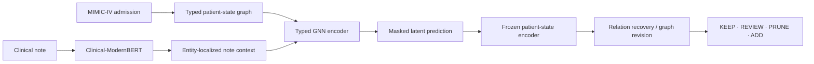

# Clinical Graph-JEPA

### Predictive patient-state knowledge graphs for cognitive decision support

[](https://openreview.net/forum?id=HXsMPubPqE)
[](https://www.python.org/)
[](https://pytorch.org/)

Clinical Graph-JEPA learns predictive patient-state representations from typed
clinical knowledge graphs. This repository provides a self-contained,
documented implementation suite for the paper, including note-free and
note-augmented Graph-JEPA models, released checkpoints, evaluation code, and a
400-admission graph dataset.

**Paper:** [OpenReview](https://openreview.net/forum?id=HXsMPubPqE) ·
[repository PDF](paper/clinical_jepa.pdf) ·
[paper-to-code map](docs/PAPER_CODE_MAP.md)

> [!IMPORTANT]
> This is a research system for improving structured patient representations.
> It does not make autonomous clinical decisions and is not intended for direct
> clinical use.

## Abstract

Clinical narratives contain relationships that are absent from structured
tables, but extraction errors, ontology mismatch, missing edges, and temporal
ambiguity can make automatically constructed knowledge graphs unreliable.
Clinical Graph-JEPA treats an extracted graph as a draft patient-state
representation rather than a finished artifact. It combines a deterministic
clinical backbone with inferred relations, then learns to recover masked or
missing graph structure from observed context using joint-embedding predictive
learning.

The paper studies two deployment settings: **Option A**, a note-free model for
admissions without available notes, and **Option B**, a note-augmented model
that places a Clinical-ModernBERT embedding only on the entities grounded by
the note. The reported entity-localized design improves inferred-edge recovery
from **0.274 to 0.419 MRR** over the note-free option while keeping the learned
world-model encoder frozen during relation readout.

## Method at a glance



Each admission graph combines deterministic relations from structured records
with clinically meaningful cross-links inferred from narrative text. Graph-JEPA
pretraining predicts masked graph regions in latent space through an online
encoder and an exponential-moving-average target encoder. A lightweight
relation readout then evaluates what belongs in the graph.

## Included implementations

| Model | Package | Entity representation | Note input | Checkpoint input |
| --- | --- | --- | --- | --- |
| **Raw Graph-JEPA v5** | `graph_jepa_v5` | 768-d SapBERT | None | 768 |
| **MIMIC Graph-JEPA v6** | `graph_jepa_v6` | 768-d SapBERT | 768-d entity-localized Clinical-ModernBERT | 1536 |
| **Paper entity-note v16** | `paper_v16` | Learned type + hashed-entity + demographics | 768-d entity-localized Clinical-ModernBERT | 774-dimensional numeric branch projected to hidden space |

The modular `v5`/`v6` models and standalone paper `v16` model come from two
related development lineages. `v16` is not a direct architectural successor of
modular `v6`, and their checkpoints are not interchangeable. See the
[paper-to-code map](docs/PAPER_CODE_MAP.md) for the exact correspondence.

## Repository contents

```text
clinical-graph-jepa/
├── data/                     Packaged graph JSONL and compatibility notes
├── docs/                     Architecture, data, evaluation, and paper mapping
├── models/                   Checkpoints, configs, and model-specific guides
├── paper/                    Repository copy of the paper
├── scripts/                  Dataset audit and checkpoint smoke checks
├── src/
│   ├── fawkes_core/          Version-neutral schema and model primitives
│   ├── graph_jepa_v5/        Note-free modular Graph-JEPA
│   ├── graph_jepa_v6/        Entity-note modular Graph-JEPA
│   └── paper_v16/            Standalone paper trainer and evaluator
└── tests/                    Independence, data, and checkpoint tests
```

The modular packages are self-contained: neither imports historical
`graph_jepa_v2`, `graph_jepa_v3`, or `graph_jepa_v4` modules.

## Quick start

### Requirements

- Python 3.10 or newer
- [`uv`](https://docs.astral.sh/uv/)
- CPU, Apple Silicon, or CUDA-supported PyTorch device

### Install and verify

```bash
git clone https://github.com/nalin2002/clinical-graph-jepa.git
cd clinical-graph-jepa
uv sync --extra test

uv run python scripts/audit_data.py
uv run python scripts/smoke_check.py
uv run pytest
```

SapBERT weights are downloaded from Hugging Face on the first modular scoring
or evaluation run and cached under `.cache/`.

## Evaluation

### Option A: raw v5 without notes

This model can be evaluated directly on the included graph dataset:

```bash
uv run python -m graph_jepa_v5.evaluate \
  --checkpoint models/v5_without_note/graph_jepa_v5.pt \
  --data jsonl \
  --jsonl-path data/fawkes_1k_patients/fawkes_1k_patients_graphs_260615.jsonl \
  --max-graphs 10 \
  --cap 500 \
  --device cpu \
  --output outputs/v5_loo.json
```

Remove `--max-graphs` and increase `--cap` for a complete run.

### Option B: modular v6 with localized notes

The included raw JSONL has no note embeddings. Supply the embedded dataset used
by the checkpoint:

```bash
uv run python -m graph_jepa_v6.evaluate \
  --checkpoint models/v6_with_note/graph_jepa_v6.pt \
  --data jsonl \
  --jsonl-path /path/to/fawkes_training_graph_full_embedded_260615.jsonl \
  --device cpu \
  --output outputs/v6_loo.json
```

### Standalone paper-v16

The standalone evaluator reads experiment switches from the environment. Match
the released checkpoint explicitly:

```bash
USE_NOTE=1 GROUND_BY=prov EMBED_DIM=768 USE_SCORES=0 PRUNE_NO_EVIDENCE=1 \
uv run python -m paper_v16.evaluate \
  --checkpoint models/paper_v16/fawkes_trainer_jepa_entity_note_v16_260615.pt \
  --data /path/to/fawkes_training_graph_full_embedded_260615.jsonl \
  --device cpu \
  --output outputs/paper_v16_loo.json
```

## Data and reproducibility

The included JSONL contains **400 admission graphs**, **17,665 nodes**, and
**22,795 edges**. It contains the structured and LLM-inferred graph topology,
but not the private note text, note embeddings, or evidence-score vectors.

| Reproduction path | Included data sufficient? |
| --- | --- |
| Raw v5 / Option A | Yes |
| Modular v6 / Option B | No - requires the original embedded JSONL |
| Paper-v16 with notes | No - requires note embeddings and provenance fields |

Running a note model with zero-filled missing vectors is structurally possible,
but it is not a faithful reproduction of the note-augmented checkpoint.

## Training

Training is model-specific. Start with the corresponding guide:

- [Raw v5 training and evaluation](models/v5_without_note/README.md)
- [v6 localized-note training and evaluation](models/v6_with_note/README.md)
- [paper-v16 training and evaluation](models/paper_v16/README.md)

For implementation details, read:

- [Architecture](docs/ARCHITECTURE.md)
- [Data contract](docs/DATA.md)
- [Evaluation protocol](docs/EVALUATION.md)
- [Paper-to-code implementation map](docs/PAPER_CODE_MAP.md)

## Citation

If you use this repository, cite the
[Clinical Graph-JEPA OpenReview paper](https://openreview.net/forum?id=HXsMPubPqE).
The repository includes a [local PDF](paper/clinical_jepa.pdf) for offline
reference. Author metadata in the supplied manuscript is anonymized, so this
README does not invent a BibTeX author list.

## Acknowledgements

This implementation builds on PyTorch, PyTorch Geometric, Hugging Face
Transformers, SapBERT, Clinical-ModernBERT, MIMIC-IV, and ACI-Bench.
