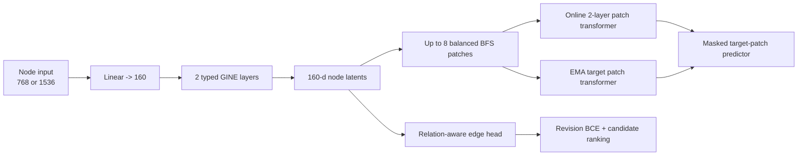
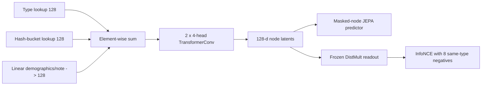

# Architecture guide


*Figure 1 from the [Clinical Graph-JEPA paper](../paper/clinical_jepa.pdf).*

## The common problem

All three models receive a typed patient-state graph. Nodes represent clinical
objects such as a patient, diagnosis, medication, procedure, microbiology
result, or service. Directed relation types describe facts such as
`HAS_DIAGNOSIS`, `TAKES_MEDICATION`, `MANAGED_FOR`, or `CONFIRMS`.

The learning problem is not ordinary text classification. A model observes most
of a graph and learns a latent patient-state representation that helps recover a
missing region or edge. The repository contains two implementation lineages:

```text
clinical_jepa lineage:  no-note variant  ->  localized-note variant
fawkes lineage:         entity-note (the paper implementation)
```

These are two lineages, not one sequence. `fawkes` is **the paper
implementation**; `clinical_jepa` is not. The two `clinical_jepa` variants are
one class under one config flag, not two models. `docs/LINEAGE.md` records why
the old `v5`/`v6`/`v16` numbers were never a release history.

## Input comparison

| Input component | Clinical-JEPA, no note | Clinical-JEPA, localized note | Fawkes entity-note |
| --- | --- | --- | --- |
| Typed nodes and relations | Yes | Yes | Yes |
| Entity text encoder | Frozen SapBERT | Frozen SapBERT | None |
| Entity identity | Encoded by SapBERT text | Encoded by SapBERT text | Learned MD5 hash bucket, 8,192 buckets |
| Demographics | Not concatenated | Not concatenated | Age/sex plus three reserved values |
| Note embedding | None | Clinical-ModernBERT, 768-d | Clinical-ModernBERT, 768-d |
| Note placement | N/A | Concatenated only on grounded nodes | Appended to numeric branch only on grounded nodes |
| Raw width entering first projection | 768 | 1536 | 6 or 774 numeric values, plus separate type/entity lookups |

### Why the note vector is localized

There is one note embedding for the whole admission, but the note discusses only
some entities. With provenance grounding, the code finds edges supported by the
note and assigns the note vector to their endpoints. Ungrounded nodes receive a
zero vector of the same size. This preserves fixed tensor shapes while telling
the model where narrative context is relevant.

## The `clinical_jepa` pipeline



### Node encoder

A linear layer maps the raw node input to 160 dimensions. Two relation-aware
GINE layers aggregate neighboring node states. Each layer includes relation
embeddings, normalization, GELU, dropout, and a residual connection.

### Patch encoder

Balanced multi-source BFS divides each patient graph into up to eight local
patches. Mean pooling summarizes the nodes in each patch. Patch positional
features describe relative patch size, connectivity, and random-walk return
behavior. A two-layer/four-head transformer models relationships among patches.

### JEPA objective

The online branch observes selected context patches and predicts four masked
target-patch latents. The target branch sees the full graph and supplies stable
targets. Its weights are an EMA of the online weights and receive no gradients.
Smooth L1 prediction plus variance/covariance regularization trains the latent
space.

### Revision and ranking

Fine-tuning hides valid edges, samples schema-compatible hard negatives, and
trains an edge MLP. Revision BCE separates present edges from plausible false
edges. Candidate ranking teaches the correct target or relation to outrank eight
hard alternatives. Typed-invalid edges are blocked from message passing.

The sole input-architecture difference is:

```text
no note:        SapBERT 768
localized note: SapBERT 768 + localized note 768 = 1536
```

Everything else is shared: the two released checkpoints have identical
`state_dict` key sets, differing only in the input width of
`context_node_encoder.input_proj` and `target_node_encoder.input_proj`. The
released runs also use different fine-tuning durations: 90 epochs without notes
and 50 with them.

## The `fawkes` pipeline (the paper implementation)



`fawkes` builds a learned type vector, a learned hashed-entity vector, and a
projected demographic/note vector for each node. These three 128-dimensional
terms are added. Two four-head `TransformerConv` layers produce node latents.

During Phase 1, 40% of nodes are hidden. The context encoder processes the
visible subgraph, while an EMA target encoder processes the complete graph. A
predictor combines global visible context and relation-aware local boundary
context to predict each hidden node latent.

During Phase 2, the graph encoder is frozen. DistMult scores a source, relation,
and target by the element-wise triple product of their vectors. InfoNCE ranks
the true target over eight same-type negatives. The four inferred relations in
the paper receive triple weight.

## Where to continue

- [Clinical-JEPA without notes: complete walkthrough](../models/clinical-jepa-no-note/README.md)
- [Clinical-JEPA with localized notes: complete walkthrough](../models/clinical-jepa-localized-note/README.md)
- [Fawkes entity-note (the paper): complete walkthrough](../models/fawkes-entity-note/README.md)
- [Lineage: old names to new names](LINEAGE.md)
- [Data contract](DATA.md)
- [Evaluation definitions](EVALUATION.md)
- [Paper-to-code map](PAPER_CODE_MAP.md)
