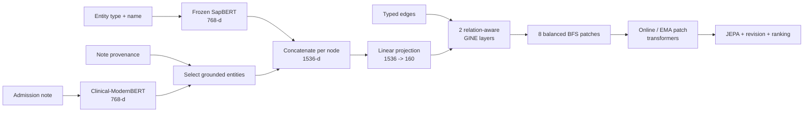

# Clinical-JEPA with entity-localized notes

This is the note-augmented setting of the modular patch-based model. Its graph
encoder, patch construction, JEPA objective, and revision heads are identical to
the no-note variant — the two are one class under one config flag. The
controlled architectural change is the node input: this variant concatenates a
localized Clinical-ModernBERT note vector to each SapBERT entity vector.

This is **not** the paper implementation — see
[`models/fawkes-entity-note/`](../fawkes-entity-note/README.md) for that. Both
localize a note vector onto grounded entities, but they are different
architectures from different lineages.

## When to use this model

Use the localized-note variant when:

- you have one 768-dimensional note embedding per admission;
- your edges identify which entities are supported by that note;
- you want note context in the modular patch-based architecture; or
- you want a direct architectural comparison with the no-note variant.

Do not use this checkpoint for a faithful experiment if your JSONL does not
contain note embeddings and provenance. Missing vectors are replaced with zeros
so the code can run, but that is not the data distribution on which the
checkpoint was trained.

## Artifacts

| File | Purpose |
| --- | --- |
| `graph_jepa_v6_pretrain.pt` | Model after masked patch pretraining |
| `graph_jepa_v6.pt` | Final model after revision and ranking fine-tuning |
| `config_pretrain.json` | Exact pretraining architecture/configuration |
| `config.json` | Exact final checkpoint configuration |

The checkpoint filenames keep the names they were released under; only the
directory was renamed. That is what makes `models/MANIFEST.json`'s checksums
byte-stable across the rename.

Implementation entry points — one set of modules serves both variants, and which
one you get is read from the checkpoint's own config:

| Module | Console script |
| --- | --- |
| `src/clinical_jepa/graph/tensors.py` | — (note localization and edge metadata) |
| `src/clinical_jepa/train/pretrain.py` | — (`python -m clinical_jepa.train.pretrain`) |
| `src/clinical_jepa/train/finetune.py` | `clinical-jepa-train` |
| `src/clinical_jepa/evaluate.py` | `clinical-jepa-eval` |
| `src/clinical_jepa/score.py` | `clinical-jepa-score` |

## Required input record

This variant starts from the same typed nodes and edges as the no-note one, then expects two additional
pieces of information:

```json
{
  "note_embedding": [0.013, -0.022, "... 766 more values ..."],
  "edges": [
    {
      "source": "N_012",
      "target": "N_003",
      "relation": "MANAGED_FOR",
      "confidence": 0.95,
      "evidence": "llm",
      "labels": {"prov_in_note": 1, "prov_ratio": 0.84}
    }
  ]
}
```

- `note_embedding` is one 768-dimensional mean-pooled
  Clinical-ModernBERT vector for the admission note.
- `labels.prov_in_note` marks an edge as grounded in the note. With the released
  `note_ground_by="prov"` setting, both endpoints of every marked edge receive
  the admission note vector.

The note text itself is not encoded during training. The model consumes the
already-computed vector in the JSONL.

## Entity-localized note input

For every node `i`, the loader constructs:

```text
entity_i = SapBERT("TYPE: normalized_name")        # 768 values

note_i = admission_note_embedding                  # 768 values, if grounded
       = zeros(768)                                 # otherwise

x_i = concat(entity_i, note_i)                     # 1536 values
```

This is why this variant has `in_dim=1536` and `base_in_dim=768`. The note is not a second
graph node and there is no `HAS_NOTE` edge. Localizing the vector prevents every
entity in a large admission graph from receiving the same diffuse context.

### Grounding modes implemented by the loader

| Mode | Nodes receiving the note vector | Intended use |
| --- | --- | --- |
| `prov` | Endpoints of edges with `prov_in_note` | Released checkpoint and preferred setting |
| `name` | Nodes whose normalized name occurs in note text | Alternative when provenance edges are unavailable |
| `all` | Every non-patient node | Ablation for admission-global diffusion |

For all modes, unselected nodes receive an explicit zero vector, so every node
still has the same 1536-dimensional shape.

## Tensor contract

| Tensor | Shape | Meaning |
| --- | --- | --- |
| `x` | `[N, 1536]` | SapBERT entity vector concatenated with localized note/zeros |
| `node_type` | `[N]` | Clinical node-type ID for schema constraints |
| `edge_index` | `[2, E]` | Directed graph connectivity |
| `edge_type` | `[E]` | Relation ID used by typed message passing |
| `note_grounded_mask` | `[N]` | Whether each node received the note vector |
| `edge_llm_confidence` | `[E]` | Numeric confidence when present |
| `edge_is_llm` | `[E]` | Whether an edge was narrative/LLM derived |
| `edge_clinical_artifact` | `[E]` | Whether an endpoint matches an administrative artifact filter |

## Architecture



After the widened input projection, this variant is structurally identical to the no-note one:

- two relation-aware GINE layers;
- 160-dimensional node and patch latents;
- up to eight balanced BFS patches;
- 8-dimensional patch positional features;
- two-layer, four-head patch transformers;
- an online branch and stop-gradient EMA target branch; and
- a 160-dimensional relation-aware edge plausibility head.

The architecture does **not** keep a separate note-processing branch after
concatenation. The input projection and GNN learn how much localized note signal
to retain and propagate.

## Training

### Stage 1: 60 epochs of masked patch pretraining

One context patch predicts four target-patch latents. The target is generated by
the EMA branch. Smooth L1 latent prediction is combined with VICReg-style
variance and covariance terms to avoid collapsed representations.

Because note context is already in `x`, both online and target encoders see the
same localized note placement, while only the graph regions designated by the
mask provide visible context to the online patch transformer.

### Stage 2: 50 epochs of revision and ranking fine-tuning

The final checkpoint uses:

- schema-aware revision BCE with three negatives per positive;
- hidden-edge candidate ranking with eight hard, schema-valid distractors;
- relation-specific LLM positive/negative confidence thresholds;
- weak-edge weight 0.6; and
- filters for medication packaging/administration artifacts and cancelled
  microbiology entries.

The shorter 50-epoch fine-tuning schedule is one checkpoint difference from
the no-note variant's 90 epochs; note localization is not the only training-run difference.

## What the model returns

For an edge candidate `(source, relation, target)`, the model combines the two
160-dimensional node latents with a learned relation vector and produces an
edge logit. The scoring workflow can:

- score existing edges;
- assign KEEP, REVIEW, or PRUNE according to configured thresholds;
- generate schema-compatible absent candidates; and
- rank the true target in leave-one-out evaluation.

## Evaluate the released checkpoint

```bash
clinical-jepa-eval \
  --checkpoint models/clinical-jepa-localized-note/graph_jepa_v6.pt \
  --data jsonl \
  --jsonl-path data/fawkes-training-graph-embedded-260615/fawkes_training_graph_full_embedded_260615.jsonl \
  --jsonl-limit 50 \
  --candidate-mode schema \
  --cap 2000 \
  --device cpu \
  --output outputs/localized_note_loo.json
```

Drop `--jsonl-limit` and raise `--cap` for a full run.

Before running, audit the file:

```bash
python scripts/audit_data.py \
  --path data/fawkes-training-graph-embedded-260615/fawkes_training_graph_full_embedded_260615.jsonl
```

Confirm that records contain `note_embedding` and edges contain provenance
labels; a successful parser run alone does not establish faithful compatibility.

## Reproduce training

```bash
python -m clinical_jepa.train.pretrain \
  --data jsonl \
  --jsonl-path data/fawkes-training-graph-embedded-260615/fawkes_training_graph_full_embedded_260615.jsonl \
  --encoder sapbert \
  --note-embedding-dim 768 \
  --note-ground-by prov \
  --epochs 60 \
  --lr 0.0008 \
  --batch_size 16 \
  --device cuda \
  --out outputs/localized_note_retrained

clinical-jepa-train \
  --checkpoint outputs/localized_note_retrained/clinical_jepa_note_pretrain.pt \
  --data jsonl \
  --jsonl-path data/fawkes-training-graph-embedded-260615/fawkes_training_graph_full_embedded_260615.jsonl \
  --epochs 50 \
  --llm-confidence-negatives \
  --clinical-artifact-filters \
  --llm-negative-weight 0.6 \
  --device cuda \
  --out outputs/localized_note_retrained
```

Checkpoints written by the current code are named from the variant, so
pretraining produces `clinical_jepa_note_pretrain.pt` and fine-tuning produces
`clinical_jepa_note.pt`, alongside `config_pretrain.json` and `config.json`.

## This variant versus the other two models

| Question | Answer |
| --- | --- |
| Is this simply the no-note variant plus notes? | Architecturally yes after input construction, but the released fine-tuning schedule also differs. |
| Does it use hashed entities? | No. Entity semantics come from frozen SapBERT. |
| Is this the paper checkpoint? | No. The paper model is `fawkes`. This variant uses patch-level GINE/transformer JEPA and a modular edge head. |
| Can the 400-record raw JSONL reproduce it? | No. That file has no note embeddings or provenance labels — and it is not present in this working tree. |

Read the [no-note variant](../clinical-jepa-no-note/README.md) for the shared
architecture and [`fawkes`](../fawkes-entity-note/README.md) for the separate
TransformerConv/DistMult implementation behind the paper.
