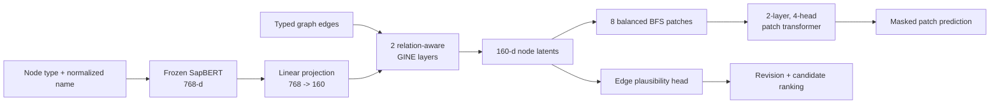

# Clinical-JEPA without notes

This is the simplest model in the repository and the best starting point for a
new reader. It learns from graph structure and biomedical entity names only; it
never reads a clinical note or a precomputed note embedding.

## When to use this model

Use the no-note variant when:

- notes are unavailable or cannot be used;
- you want to run on graph topology and entity names alone;
- you want the modular patch-based Graph-JEPA architecture; or
- you need a note-free baseline for comparison with the localized-note variant.

This is **not** the paper implementation — see
[`models/fawkes-entity-note/`](../fawkes-entity-note/README.md) for that.

## Artifacts

| File | Purpose |
| --- | --- |
| `graph_jepa_v5_pretrain.pt` | Model after masked patch pretraining |
| `graph_jepa_v5.pt` | Final model after revision and ranking fine-tuning |
| `config_pretrain.json` | Exact pretraining architecture/configuration |
| `config.json` | Exact final checkpoint configuration |

The checkpoint filenames keep the names they were released under; only the
directory was renamed. That is what makes `models/MANIFEST.json`'s checksums
byte-stable across the rename.

Implementation entry points — one set of modules serves both variants, which one
you get is read from the checkpoint's own config:

| Module | Console script |
| --- | --- |
| `src/clinical_jepa/train/pretrain.py` | — (`python -m clinical_jepa.train.pretrain`) |
| `src/clinical_jepa/train/finetune.py` | `clinical-jepa-train` |
| `src/clinical_jepa/evaluate.py` | `clinical-jepa-eval` |
| `src/clinical_jepa/score.py` | `clinical-jepa-score` |

## Input: from one graph record to tensors

Each JSONL line is one admission graph. At minimum it supplies:

```json
{
  "subject_id": 123,
  "hadm_id": 456,
  "nodes": [
    {"id": "N_001", "type": "DIAGNOSIS", "normalized_name": "atrial fibrillation"}
  ],
  "edges": [
    {"source": "N_000", "target": "N_001", "relation": "HAS_DIAGNOSIS"}
  ]
}
```

The loader normalizes the field names, resolves node IDs to integer positions,
and creates these PyTorch Geometric tensors:

| Tensor | Shape | Meaning |
| --- | --- | --- |
| `x` | `[N, 768]` | SapBERT representation of every node |
| `node_type` | `[N]` | Integer clinical node-type ID used by schema logic |
| `edge_index` | `[2, E]` | Source and target node indices |
| `edge_type` | `[E]` | Integer relation ID |

### SapBERT node representation

For each node, the model builds the text `"{TYPE}: {normalized_name}"`. For example:

```text
DIAGNOSIS: atrial fibrillation
MEDICATION: metoprolol
PROCEDURE: echocardiogram
```

The frozen `cambridgeltl/SapBERT-from-PubMedBERT-fulltext` encoder takes the CLS
token, produces a 768-dimensional vector, and L2-normalizes it. SapBERT was
trained to place synonymous biomedical concepts near one another, so names such
as `myocardial infarction` and `heart attack` receive semantically related
vectors. The embeddings are cached on disk. SapBERT is not fine-tuned here.

No demographic vector and no note vector are concatenated in this model:

```text
node input = SapBERT(TYPE + entity text) = 768 dimensions
```

## Architecture



### 1. Typed GNN encoder

`GraphNodeEncoder` first projects each 768-dimensional node vector to the
160-dimensional hidden space. It then applies two GINE message-passing layers.
Each edge relation has a learned embedding, so a `TAKES_MEDICATION` neighbor can
affect a node differently from a `HAS_DIAGNOSIS` neighbor. Every layer uses
LayerNorm, GELU, dropout 0.1, and a residual connection. The output is a
160-dimensional latent per node.

### 2. Balanced graph patches

Patient graphs vary in size, so the model groups nearby nodes into up to eight patches:

1. choose graph-spread seed nodes;
2. expand them with balanced multi-source BFS;
3. assign each node to one local patch;
4. mean-pool node latents inside each patch; and
5. add an 8-dimensional patch-position description containing relative size,
   patch-graph degree, and random-walk return features.

This turns a variable-size patient graph into a small sequence of local clinical
regions without requiring METIS or fixed-size padding at dataset level.

### 3. Online and EMA target branches

The online branch contains the trainable node encoder, positional projection,
and a two-layer/four-head patch transformer. The target branch starts as a copy
and is updated by exponential moving average (EMA), beginning at 0.996 and
approaching 1.0. Gradients do not update the target branch directly.

For each training task, one patch supplies visible context and four patches are
selected as prediction targets. The online predictor receives the masked-patch
representation and positional information, then predicts the corresponding
target-branch latent.

## Training objectives

### Stage 1: 60 epochs of JEPA pretraining

The pretraining loss contains:

- **latent prediction loss:** Smooth L1 distance between predicted and target
  patch latents;
- **variance regularization:** discourages every latent dimension from becoming
  constant; and
- **covariance regularization:** discourages different dimensions from carrying
  identical information.

This stage does not require edge correctness labels. The graph itself provides
the masked-prediction task.

### Stage 2: 90 epochs of graph-revision fine-tuning

Fine-tuning adds two supervised-by-structure tasks:

- **Schema-aware revision BCE.** Hide 25% of valid observed edges, treat them as
  positives, and sample three hard false edges per positive. Typed-invalid
  observed edges and invalid reversed directions become explicit negatives.
- **Candidate ranking.** Hide valid edges and rank each true edge against eight
  schema-valid distractors created by changing its source, target, or relation.
  The checkpoint uses temperature 0.2.

Known typed-invalid edges are removed from GNN message passing, preventing an
invalid edge from influencing the latent that is later used to reject it.
Confidence thresholds and clinical-artifact filters can also down-weight weak
LLM edges during this stage.

## Inference and output

The edge plausibility head combines:

```text
[source latent (160), target latent (160), relation embedding (160)]
                         -> MLP -> one edge logit
```

The scoring layer uses schema guards and relation-specific thresholds to assign
revision actions or propose schema-compatible candidates. The evaluator instead
removes one true edge and asks the model to rank its true target among valid
alternatives.

## Evaluate the released checkpoint

From the repository root:

```bash
clinical-jepa-eval \
  --checkpoint models/clinical-jepa-no-note/graph_jepa_v5.pt \
  --data jsonl \
  --jsonl-path data/fawkes-training-graph-embedded-260615/fawkes_training_graph_full_embedded_260615.jsonl \
  --jsonl-limit 50 \
  --candidate-mode schema \
  --cap 2000 \
  --device cpu \
  --output outputs/no_note_loo.json
```

Drop `--jsonl-limit` and raise `--cap` for a full run. `--jsonl-path` has a
default, but it names a file this repository does not contain, so pass it.

The first run downloads SapBERT. Use the same encoder cache for training and
evaluation so identical node text always maps to identical stored vectors.

## Reproduce training

```bash
python -m clinical_jepa.train.pretrain \
  --data jsonl \
  --jsonl-path data/fawkes-training-graph-embedded-260615/fawkes_training_graph_full_embedded_260615.jsonl \
  --no-note-embeddings \
  --encoder sapbert \
  --epochs 60 \
  --lr 0.0008 \
  --batch_size 16 \
  --device cuda \
  --out outputs/no_note_retrained

clinical-jepa-train \
  --checkpoint outputs/no_note_retrained/clinical_jepa_no_note_pretrain.pt \
  --data jsonl \
  --jsonl-path data/fawkes-training-graph-embedded-260615/fawkes_training_graph_full_embedded_260615.jsonl \
  --epochs 90 \
  --llm-confidence-negatives \
  --clinical-artifact-filters \
  --llm-negative-weight 0.6 \
  --device cuda \
  --out outputs/no_note_retrained
```

Checkpoints written by the current code are named from the variant, so
pretraining produces `clinical_jepa_no_note_pretrain.pt` and fine-tuning
produces `clinical_jepa_no_note.pt`, alongside `config_pretrain.json` and
`config.json` sidecars.

> [!NOTE]
> A training run is not bit-reproducible above one intra-op thread: CPU backward
> reduces across threads in an unfixed order, so two identical runs drift about
> `4.6e-7` on the parameters after one epoch. `torch.set_num_threads(1)` removes
> it. Evaluation is forward-only and unaffected.

CPU evaluation is supported. A CUDA device is recommended for full training.
Exact numeric reproduction also depends on the original graph ordering, split,
software versions, and hardware determinism.

## What this variant does not contain

- no Clinical-ModernBERT note embedding;
- no hashed entity lookup table;
- no standalone DistMult readout; and
- no assumption that a discharge note exists.

Continue with the
[localized-note variant](../clinical-jepa-localized-note/README.md) to see how
the same model changes when entity-localized note context is added.
