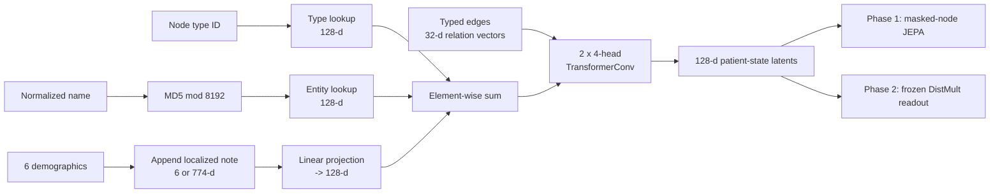

# Paper entity-note v16

This is the standalone experiment implementation packaged from
`fawkes_trainer_jepa_entity_note_v16_wmatbooth_260723.py`. It is the closest
code path to the entity-localized note experiment and reported checkpoint in
the paper.

Read the [paper PDF](../../paper/clinical_jepa.pdf),
[OpenReview record](https://openreview.net/forum?id=HXsMPubPqE), and
[paper-to-code map](../../docs/PAPER_CODE_MAP.md) alongside this guide.

## Important naming clarification

Paper-v16 and modular Graph-JEPA v6 are separate development lineages. The name
`v16` is an experiment revision number, not evidence that this is a drop-in
upgrade of modular v6. Their inputs, GNNs, pretraining units, readout heads, and
checkpoint state dictionaries differ.

## Artifact and exact saved configuration

| Item | Released value |
| --- | --- |
| Checkpoint | `fawkes_trainer_jepa_entity_note_v16_260615.pt` |
| Source | `src/paper_v16/trainer.py` |
| Local evaluator | `src/paper_v16/evaluate.py` |
| Hidden width | 128 |
| GNN | 2 `TransformerConv` layers, 4 heads |
| Note mode | Enabled, 768-d, grounded by provenance |
| Numeric/note input width | 774 |
| Evidence-score gate | Disabled in saved checkpoint |
| No-evidence pruning | Enabled |
| Node mask ratio | 0.4 |
| Edge mask schedule | 0.1 to 0.6 |
| Type-matched negatives | 8 |
| Random seed | 42 |

The source is intentionally environment-configurable, but environment values
that affect tensor shapes must match the checkpoint during loading.

## Input record

Each JSONL line represents one admission and contains nodes, edges,
demographics, an optional note, and a precomputed note embedding:

```json
{
  "subject_id": 123,
  "hadm_id": 456,
  "anchor_age": 67,
  "gender": "F",
  "note_embedding": [0.013, -0.022, "... 766 more values ..."],
  "nodes": [
    {"id": "N_001", "type": "DIAGNOSIS", "normalized_name": "atrial fibrillation"}
  ],
  "edges": [
    {
      "source": "N_012",
      "target": "N_001",
      "relation": "MANAGED_FOR",
      "evidence": "llm",
      "labels": {"prov_in_note": 1, "prov_ratio": 0.84}
    }
  ]
}
```

Unlike v5/v6, paper-v16 does not call SapBERT when constructing nodes. It creates
three input channels and adds them after projecting them to the same hidden
width.

## Node representation, step by step

### 1. Learned node-type embedding

Every node type has a trainable 128-dimensional lookup vector. The vocabulary
includes patient, diagnosis, medication, microbiology, procedure, service, lab
test, procurement, and a retained NOTE type. v16 localizes note vectors onto
existing entities, so it does not create a NOTE node during normal use.

### 2. Hashed entity representation

The normalized entity name is converted to an integer bucket:

```text
bucket = integer(MD5(normalized_name)) mod 8192
entity_vector = learned_embedding_table[bucket]      # 128-d
```

For example, every occurrence of `atrial fibrillation` deterministically maps
to the same one of 8,192 buckets and therefore shares the same learned vector.
This is a compact trainable identity representation, not a semantic language
embedding. Two unrelated names can collide in the same bucket, and the model
does not know that two synonyms are related unless graph context teaches it.

### 3. Demographic and note branch

The six base numeric values are:

```text
[age / 100, is_male, is_female, 0, 0, 0]
```

When `USE_NOTE=1`, a 768-dimensional Clinical-ModernBERT vector is appended:

```text
grounded entity:   [6 demographics | 768 note values] = 774 values
ungrounded entity: [6 demographics | 768 zeros]       = 774 values
```

When `USE_NOTE=0`, `numfeat` contains only the six values. This exact code uses
**774**, not 778, in note mode. It also does not append SapBERT, so 1536/1550 is
not the standalone paper-v16 design.

### 4. Combining the channels

The initial 128-dimensional state is an element-wise sum:

```text
h_i = type_embedding[type_i]
    + entity_embedding[hash(name_i)]
    + Linear(numfeat_i)
```

The three raw inputs are **not concatenated** after projection. This keeps every
node at hidden width 128 before graph message passing.

## Localizing the note

The released checkpoint uses `GROUND_BY=prov`:

1. inspect every edge's `labels.prov_in_note` value;
2. mark both endpoints of supported edges as note-grounded;
3. copy the same admission-level 768-dimensional note vector to those nodes;
4. place a 768-dimensional zero vector on every other node.

Two ablations remain in the source:

- `GROUND_BY=name` grounds a node if its normalized name occurs in note text;
- `GROUND_BY=all` places the vector on every non-patient entity.

There is no new note node and no active `HAS_NOTE` relation. Localization tells
the model which entities the admission-level summary is relevant to.

## Edge representation and evidence

The source recognizes 21 forward relation types and creates a distinct inverse
type for each direction during message passing. Each relation maps to a learned
32-dimensional edge embedding.

It can also construct a 14-value evidence vector containing model confidence,
biomedical linkage/similarity signals, OMOP proximity, and note provenance. If
`USE_SCORES=1`, a learned sigmoid gate scales the relation embedding. The
released checkpoint has `USE_SCORES=0`, so these values do not enter its GNN.

With `PRUNE_NO_EVIDENCE=1`, LLM-derived edges with neither biomedical support
nor note provenance are removed before training. Deterministic backbone edges
remain.

## Architecture



### Graph encoder

Two four-head `TransformerConv` layers pass relation-conditioned messages over
the graph. Each head has width 32, and concatenating four heads returns the
128-dimensional hidden width. LayerNorm and ReLU follow each layer. Forward and
inverse edge types allow direction-specific messages.

## Phase 1: self-supervised world-model learning

The JEPA module contains:

- a trainable context encoder;
- a stop-gradient target encoder initialized from the context encoder;
- a two-layer predictor;
- relation-aware slot embeddings; and
- EMA updates from context to target, scheduled from 0.996 to 0.9999.

For each mini-batch, 40% of nodes become prediction targets:

1. remove target nodes from the context subgraph;
2. encode the remaining nodes with the context encoder;
3. mean-pool visible context into one graph summary;
4. collect messages crossing from visible neighbors toward each hidden node;
5. combine graph summary, local slot context, and target type information;
6. predict the hidden node's normalized target-encoder latent; and
7. minimize cosine distance `2 - 2 * dot(prediction, target)`.

The target encoder sees the complete graph but receives no gradients. It is
updated only by EMA. This is node-level masking, whereas modular v5/v6 predict
balanced BFS patch latents.

## Phase 2: frozen edge-recovery readout

After 60 JEPA epochs, the checkpoint freezes the context encoder and trains a
DistMult relation scorer for 40 epochs:

```text
score(source, relation, target)
    = sum(source_latent * relation_vector * target_latent)
```

During each training step, 10%-60% of edges are hidden. For every positive
target, the code samples eight negative targets of the same node type from the
same mini-batch. InfoNCE makes the true target the first/highest logit. The four
paper-focused inferred relations - `MANAGED_FOR`, `CONFIRMS`,
`COMPLICATED_BY`, and `INDICATES` - receive weight 3.0.

Because the encoder is frozen, edge-recovery performance tests the patient-state
representation learned in Phase 1 rather than allowing the GNN to specialize
jointly to the evaluation decoder.

## Evaluation

### Leave-one-out edge recovery

For each query, the evaluator:

1. removes exactly one true edge and its generated inverse;
2. re-encodes the graph without that edge;
3. collects candidate targets having the same node type as the true target;
4. filters other already-true targets for the same source/relation pair; and
5. records the rank of the hidden target.

Reported metrics are MRR and Hits@1/3/10. This protocol measures recovery, not
clinical outcome prediction.

### Cascade evaluation

The cascade test starts with deterministic backbone edges and evaluates inferred
relations in order:

```text
MANAGED_FOR -> CONFIRMS -> COMPLICATED_BY -> INDICATES
```

It compares a backbone-only floor, an oracle cascade where earlier gold relation
families are added to context, and a leave-one-out ceiling with all other edges
available. The reverse order is also evaluated to measure order sensitivity.

## Evaluate the released checkpoint

Configuration flags that determine dimensions are set before module import, so
pass them explicitly:

```bash
USE_NOTE=1 GROUND_BY=prov EMBED_DIM=768 USE_SCORES=0 PRUNE_NO_EVIDENCE=1 \
uv run python -m paper_v16.evaluate \
  --checkpoint models/paper_v16/fawkes_trainer_jepa_entity_note_v16_260615.pt \
  --data /path/to/fawkes_training_graph_full_embedded_260615.jsonl \
  --device cpu \
  --output outputs/paper_v16_loo.json
```

The packaged raw JSONL cannot faithfully evaluate this note checkpoint because
it contains neither note embeddings nor evidence/provenance label dictionaries.

## Retrain Option B with notes

Set `PUSH=0` unless you deliberately want the script to upload its checkpoint:

```bash
DATA_PATH=/path/to/fawkes_training_graph_full_embedded_260615.jsonl \
USE_NOTE=1 GROUND_BY=prov EMBED_DIM=768 \
USE_SCORES=0 PRUNE_NO_EVIDENCE=1 PUSH=0 \
uv run python -m paper_v16.trainer
```

## Retrain Option A without notes

The packaged data has no evidence vectors, so disable evidence pruning:

```bash
DATA_PATH=data/fawkes_1k_patients/fawkes_1k_patients_graphs_260615.jsonl \
USE_NOTE=0 PRUNE_NO_EVIDENCE=0 PUSH=0 \
uv run python -m paper_v16.trainer
```

This executes the paper-v16 no-note architecture, but exact checkpoint
reproduction still requires the original split/order and evidence-scored source
dataset.

## Paper-v16 versus modular v6

| Component | Paper-v16 | Modular v6 |
| --- | --- | --- |
| Entity semantics | Learned MD5 hash bucket | Frozen SapBERT vector |
| Note placement | In 774-d numeric branch | Concatenated with SapBERT to 1536-d |
| GNN | `TransformerConv`, 2 layers, 4 heads | Relation-aware GINE, 2 layers |
| JEPA prediction unit | Individual masked node | Balanced BFS patch |
| Latent width | 128 | 160 |
| Readout | Frozen DistMult + InfoNCE | MLP edge head + revision/ranking losses |
| Checkpoint compatibility | Only paper-v16 | Only modular v6 |
